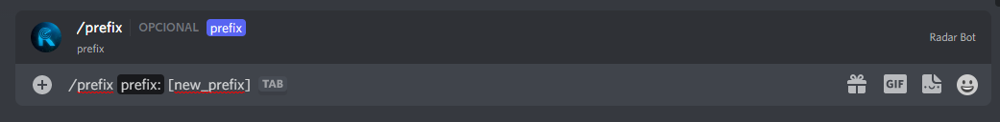

### 😀 Change Prefix

**To change the bot's prefix, use this command:**&#x20;

*/prefix \[new\_prefix]*

**The bot will respond:**

**And ready you changed the profile on your server**


Only server administrators (users with`ADMINISTRATOR`permission) can modify RadarBot prefix settings!
