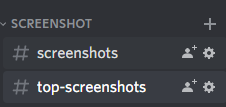
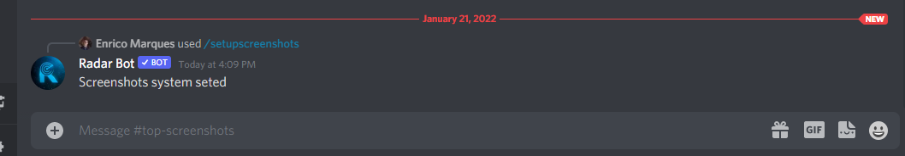
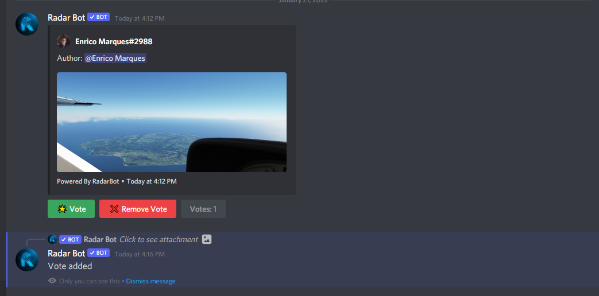
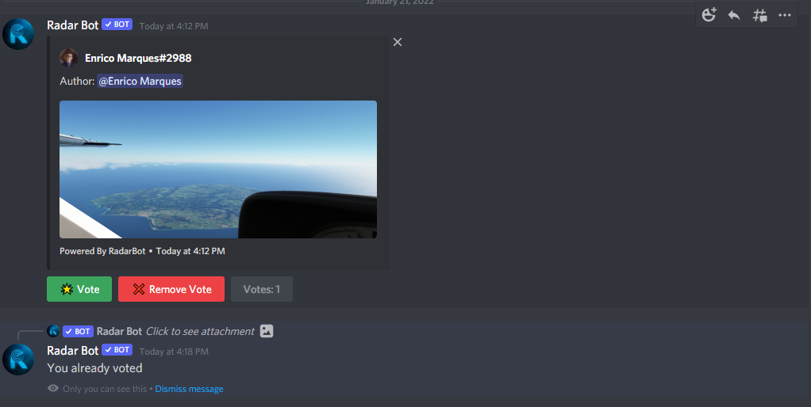
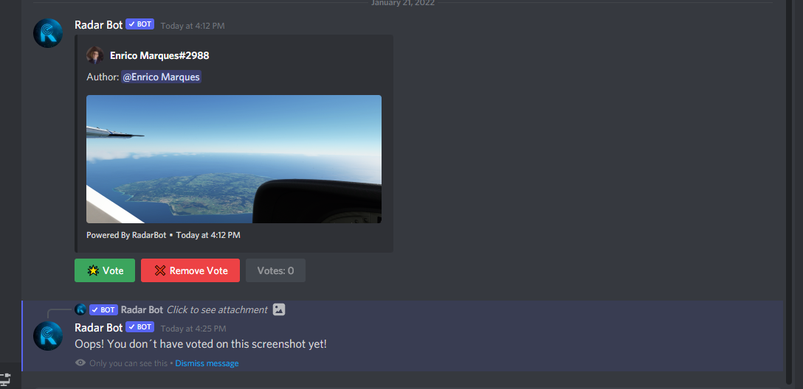
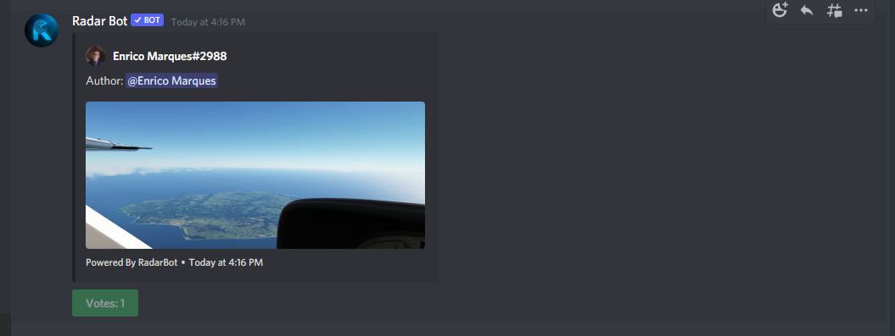
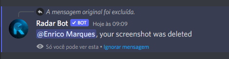
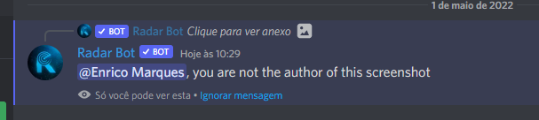
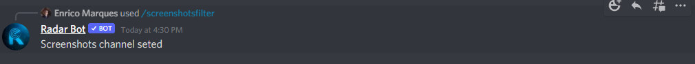

---

title: 📸Setup Screenshots System
---


### What is the screenshot system?

*The screenshot system is a way to vote for the best screenshot on the server! Where members put their photos in a channel (you can choose the channel), the bot recognizes them and adds the 3 items (Add Vote, Remove Vote and the amount of votes) soon we will talk more about them. After the bot adds the items, the vote is released when it reaches the minimum votes you chose in the configuration, this photo is sent to another channel (generally named Top-Screenshots, but it's your choice) where the best screenshots are and who decides is the members of the server itself!*


## Configuring the Screenshot System
**First step**

*Create two channels, one for members to post their photos and one for the best screenshots*




:::caution
     
For the correct functioning of the screenshot system, check that the bot's permission to send Embed Message in these channels is enabled

For this, go to the channel settings -> permissions -> Add the bot as a custom permission option -> and enable these options ```EMBED_LINK``` and ```MANAGE_MESSAGES```, as shown in the pictures below


:::
**Second step**


*Enter the setup command for this type ```/setupscreenshot``` 
it will ask for 3 arguments:*

* **screenshotschannel:** *Here you choose the channel where the member will put his photos, in my case I will put #screenshots*

* **topscreenshotschannel:** *Here you choose the channel of the best screenshots, in my case I will put #top-screenshots*

* **minimumvotes:** *Here you choose the amount of minimum votes that you have to have for the photo to go to the channel of the best screenshots, in my case for demonstration purposes I will put 1 vote but feel free to put as many as you think necessary.*


*The bot will respond:*


**and the system will be configured, let's test it?**

* *Put a photo in the channel set for photos*


*We can see that it is working and also the 3 elements that I had talked about earlier*

**If you click vote:**



*He registers the vote and sends a private message that it worked!*

**If you click vote but you already have a vote from that member:**



*It doesn't let you add another vote, only one per member, the message is also private*

**If you remove the vote:**


*He warns that he removed the vote in a private message*

**If you remove the vote when you have no vote for that member:**



*He warns that he doesn't have any votes, also in a private message*

**And after reaching the minimum number of votes, the bot sends a photo to the channel configured for the best screenshots**



**If you want to delete an image you just uploaded, just click on the delete button and your image will be deleted.**



**But if the photo is not yours and you try to delete the bot, it will respond:**




**To block text in the vote posting channel use this command:**



*The bot will send confirmation that it worked and every time you send a text in this channel it will delete the message sent and will send a message in private:*


**If you want to disable the screenshot system use the command:** ```/deactivatescreenshots ```


*It will send the command and it will be disabled*


:::caution

Only server administrators (users with`ADMINISTRATOR`permission) can set Screenshot System

:::


*If you have any questions, join our support server by clicking [here](https://discord.com/invite/DEtGv4wUNX)*


