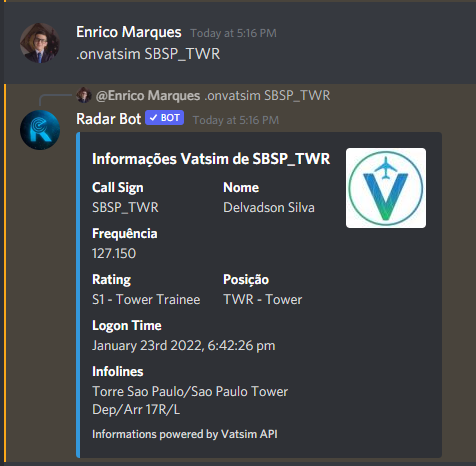

### /vatsim [location] or .vatsim [location]

*In this command you put a location, in my case I am putting an ICAO start, the bot will search the Vatsim API information and will show all active positions with those initials*

**If you enter a that no one is connected:**

*The bot will return an error message that no one is currently connected with that callsign*

//Rever Foto em português

### /onvatsim [callsign] or .vatsim [callsign]
**ATC**

**Pilot**

*Coming Soon*