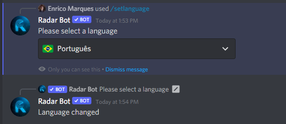

### /setlanguage

!!! note
    This command is available by Slash Commands, make sure the bot is allowed to use this type of command on your server
!!! warning
    Only server administrators (users with`ADMINISTRATOR`permission) can modify Language the RadarBot!

*This command is used to set a language on the server (Portuguese, English, Spanish and French are now available, but soon with others), to set a language type ``/setlanguege`` and the bot will respond:*
<figure markdown>

</figure>

*Click on the **Please select a language** option and an option box will open with the available languages:*
<figure markdown>

</figure>

*Choose the language that fits your server in my case I will choose Portuguese and the bot will respond that the language has been changed*
<figure markdown>

</figure>