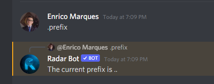
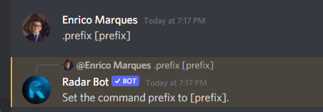
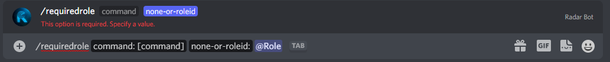

# Configuração
### .prefix or /prefix 

!!! warning "Atenção"
      Somente administradores de servidor (usuários com permissão de `ADMINISTRATOR`) podem modificar as configurações de prefixo do RadarBot!

Esse comando tem a função mostrar o prefixo configurado de colocado desta forma:

<figure markdown>

</figure>

Ou se você colocar ```.prefix [prefix]``` o bot irá alterar o prefixo se você quiser um guia detalhado para alterar o prefixo clique [aqui](../../guides/change-prefix)

<figure markdown>

</figure>


###  /requiredrole 

!!! warning "Atenção"
      Somente administradores de servidor (usuários com permissão de `ADMINISTRATOR`) podem modificar as configurações do RadarBot!

*Este comando você pode bloquear comandos para posições específicas para este tipo o comando abaixo:*


<figure markdown>

</figure>


*Na foto abaixo a resposta do Bot:*

!!! note "Nota"
      Mudei [comando] para taf para fazer a demonstração

<figure markdown>

</figure>

### .language or /language

!!! warning "Atenção"
      Somente administradores de servidor (usuários com permissão de `ADMINISTRATOR`) podem modificar as configurações do RadarBot!

*Para saber o idioma que o Radar Bot está usando no servidor use este comando*

<figure markdown>

</figure>

!!! note "Nota"
    Se você quiser alterar o idioma, use este [comando](../Settings/#setlanguage)

### .command or /command 

!!! warning "Atenção"
      Somente administradores de servidor (usuários com permissão de `ADMINISTRATOR`) podem modificar as configurações do RadarBot!

*Para desabilitar ou habilitar um comando Radar Bot em seu servidor use este comando*


***.command <"enable" or "disable"> <"Nome do Comando">***

<figure markdown>

</figure>

*e o bot responderá:*

<figure markdown>

</figure>


### .channelonly or /channelonly

!!! warning "Atenção"
      Somente administradores de servidor (usuários com permissão de `ADMINISTRATOR`) podem modificar as configurações do RadarBot!

*Para permitir ou não um comando em um canal específico do seu servidor use este comando*

<figure markdown>

</figure>

*e o bot responderá:*

<figure markdown>

</figure>
