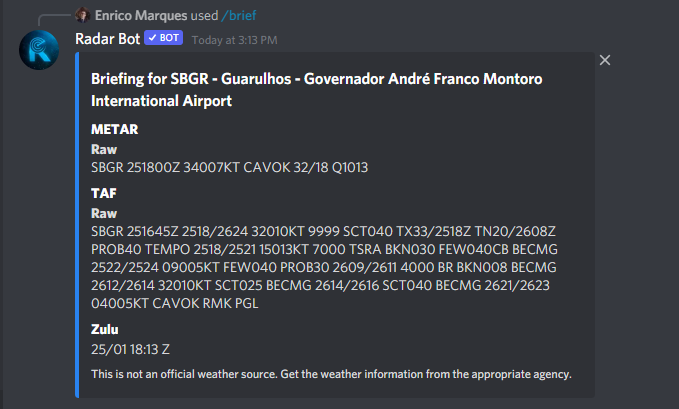
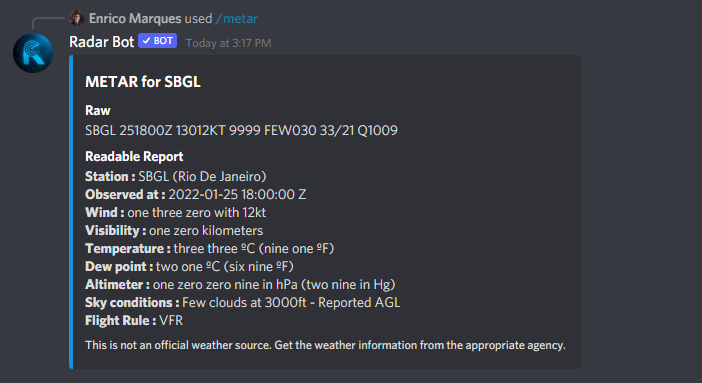
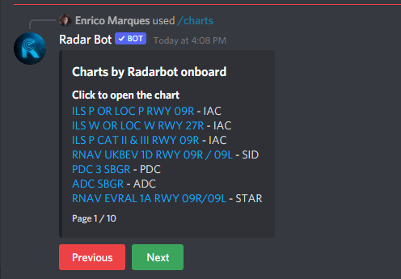

# Utilitários de Voo
### .brief[ICAO] or /brief[ICAO]

*Você está voando ou controlando e quer saber rapidamente o horário do metar, taf e Horário Zulu, basta digitar o comando brief e o ICAO do aeroporto que deseja essa informação e em poucos segundos o bot retornará:*
<figure markdown>

</figure>

### .metar[ICAO] or /metar[ICAO]

*Quer mais detalhes do metar do aeroporto, ou melhor já decodificado basta digitar o comando metar, ele responderá com o metar já decodificado para você*

<figure markdown>

</figure>

### .taf[ICAO] or /taf[ICAO]

*Se o comando metar não foi suficiente, temos o comando taf, ele enviará o taf decodificado para facilitar sua simulação*
<figure markdown>

</figure>

### /charts[ICAO]

!!! note "Nota"
    Este comando está disponível por Slash Commands, verifique se o bot tem permissão para usar esse tipo de comando em seu servidor

*Para ter as cartas dos EUA e do Brasil diretamente em discord, use nosso comando de letras, o bot fará uma paginação com as cartas recebidas via API para navegar entre as páginas use os botões abaixo da mensagem*
<figure markdown>

</figure>

!!! note
    Somente quem executou o comando pode mover as páginas, caso algum outro membro interfira, o bot enviará uma mensagem privada
!!! note
    Após 120 segundos o comando foi executado, os botões são desabilitados