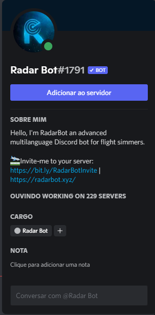
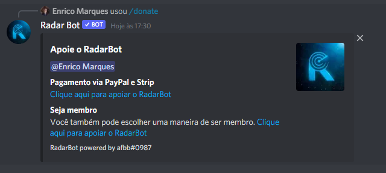

# Geral
### Invite

*Não é exatamente um comando, mas se você quiser encontrar o link do Radar Bot diretamente pelo discord, basta clicar no nome do Radar Bot em qualquer mensagem e depois em "Add to Server"*

<figure markdown>
   

</figure>

### .donate or /donate

*Se você quer ajudar no desenvolvimento e continuar online 24 horas por dia, temos as opções  de Paypal ou ainda você pode ser um Membership Radar Bot, tendo benefícios como Posição de Apoiador no servidor Bot, Acesso antecipado a novas atualizações entre outros benefícios, Se você fosse, você daria uma olhada?*
<figure markdown>

</figure>

### .ping or /ping

*Para saber o tempo de resposta do bot, use o comando ping do Radar Bot, ele informará seu Ping em relação ao Gateway*
<figure markdown>

</figure>