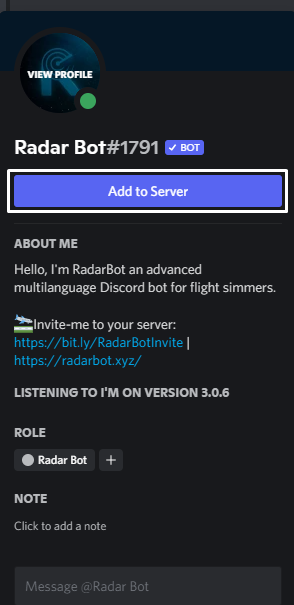

# Geral
### Invite

*It's not exactly a command but if you want to find the Radar Bot link directly through discord, just click on the Radar Bot name in any message and then on "Add to Serve"*

<figure markdown>
   

</figure>

### .donate or /donate

*If you want to help the development and continue to keep it online 24/7, Paypal has two options and you can be a MemberShip Radar Bot, having benefits such as Supporter Position on the Bot server, Early access to new updates among other benefits, if If you were, would you take a look?*
<figure markdown>

</figure>

### .ping or /ping

*To know the quality of your internet directly on discord, use the Radar Bot ping command, it will inform your Ping in relation to the Gateway*
<figure markdown>

</figure>