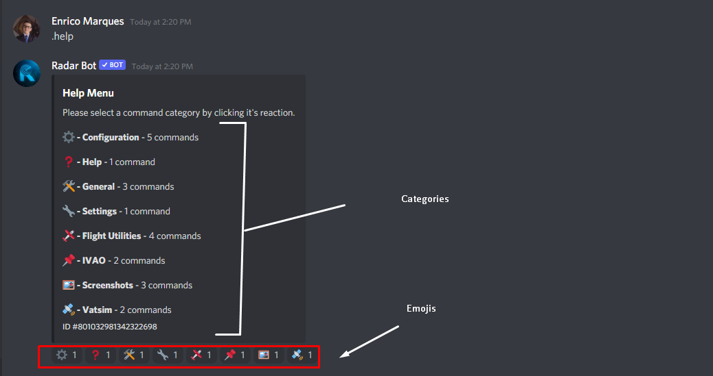

# Help
### .help

*O comando help mostra os comandos disponíveis no servidor, possui uma navegação emoji onde você pode entrar e sair das páginas, os comandos são divididos em categorias, as mesmas categorias deste docs na foto abaixo podemos ver detalhes de uso deste comando*
<figure markdown>

</figure>