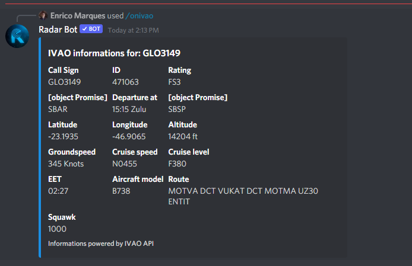

### /ivao[location] or .ivao[location]

*Este comando mostra informações de uma ICAO ou início de uma, tirando essas informações da API da IVAO, como você pode ver na foto abaixo:*
<figure markdown>

</figure>

### /onivao[ICAO] or .onivao[ICAO]

*O comando onivao mostra informações detalhadas de um controlador ou piloto conectado a rede, as informações utilizadas vem da API IVAO nas fotos abaixo podemos ver o funcionamento do comando para ATC e Piloto*

**Pilot**
<figure markdown>

</figure>

**ATC**
<figure markdown>

</figure>