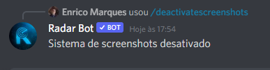

!!! warning "Atenção"
      Somente administradores de servidor (usuários com permissão de `ADMINISTRATOR`) podem modificar o sistema de capturas de tela do RadarBot!

### /setupscreenshots
!!! note
    Este comando está disponível por Slash Commands, verifique se o bot tem permissão para usar esse tipo de comando em seu servidor

*Comando para configurar o sistema de screenshots no servidor, ele irá pedir alguns argumentos como canal de screenshots, canal top screenshots e votos mínimos caso queira ver um guia explicado passo a passo de como configurar este sistema em seu servidor clique [aqui ](../../guides/setup-screenshots/)*
<figure markdown>

</figure>

### /screenshotsfilter or .screenshotsfilter

*Este comando permite ou não o uso de texto no canal escolhido por você de screenshots (canal onde os membros colocam as screenshots) se você executar este comando ele não parará de enviar texto e enviará uma mensagem em privado para o membro que tentar envie a mensagem*
<figure markdown>

</figure>

### /deactivatescreenshots or .deactivatescreenshots 

*Este comando desabilita o sistema de screenshots do servidor para usar basta digitar ``/deactivatescreenshots`` ou ``.deactivatescreenshots`` e se quiser o sistema novamente basta digitar o comando para configurar o sistema*
<figure markdown>

</figure>