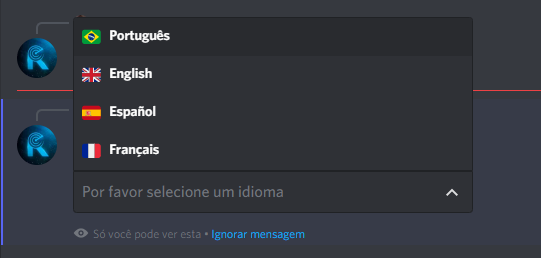

# Configurações
### /setlanguage

!!! note
    Este comando está disponível por Slash Commands, verifique se o bot tem permissão para usar esse tipo de comando em seu servidor
!!! warning
    Apenas administradores de servidor (usuários com permissão de `ADMINISTRATOR`) podem modificar o idioma do RadarBot!

*Este comando é usado para definir um idioma no servidor (português, inglês, espanhol e francês já estão disponíveis, mas em breve com outros), para definir um tipo de idioma ``/setlanguege`` e o bot responderá:*
<figure markdown>

</figure>

*Clique na opção **Selecione um idioma** e uma caixa de opções será aberta com os idiomas disponíveis:*
<figure markdown>

</figure>

*Escolha o idioma que mais se adequa ao seu servidor no meu caso vou escolher português e o bot responderá que o idioma foi alterado*
<figure markdown>

</figure>