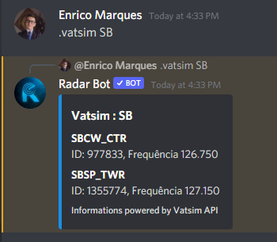
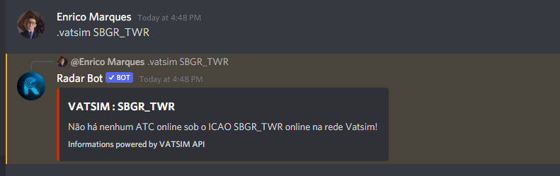
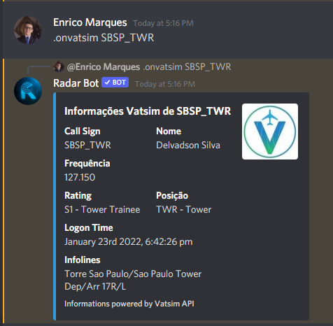
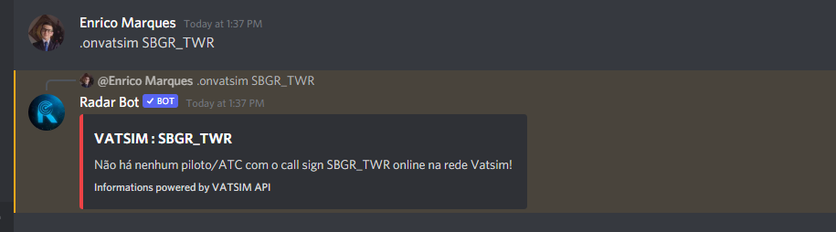

### /vatsim [location] or .vatsim [location]

*Neste comando você coloca uma localização, neste caso foi colocado o ICAO SB, o bot irá buscar as informações da API do Vatsim e mostrará todas as posições ativas com essas iniciais*

<figure markdown>

</figure>

**Se você inserir um que ninguém está conectado:**

*O bot retornará uma mensagem de erro informando que ninguém está conectado com esse indicativo*

<figure markdown>

</figure>

### /onvatsim [callsign] or .onvatsim [callsign]
*O comando onvatsim mostra informações de pessoas online no Vatsim com detalhes, por enquanto está funcionando apenas para ATCs mas já estamos corrigindo a versão piloto*

**ATC**
<figure markdown>

</figure>

**Piloto**

*Em Breve*

**Se você inserir um que ninguém está conectado:**

*O bot retornará uma mensagem de erro informando que ninguém está conectado com esse indicativo*

<figure markdown>

</figure>