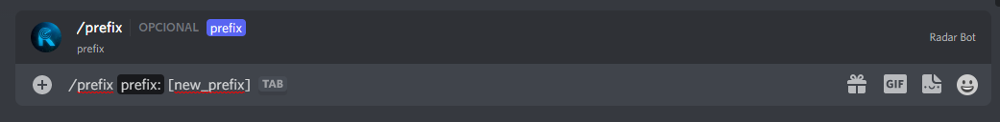

# 😀Alterar prefixo

**Para alterar o prefixo do bot, use este comando:**&#x20;

!!! example  "Alterar prefixo"

      /prefixo [_novo_prefixo_]

**O bot responderá:**

**E pronto você mudou o prefixo no seu servidor**

!!! warning "Atenção"
       Somente administradores de servidor (usuários com permissão de `ADMINISTRATOR`) podem modificar as configurações de prefixo do RadarBot!