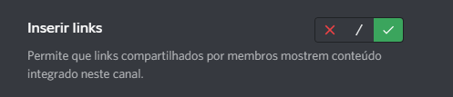
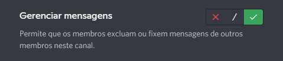
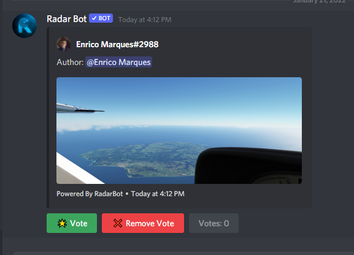
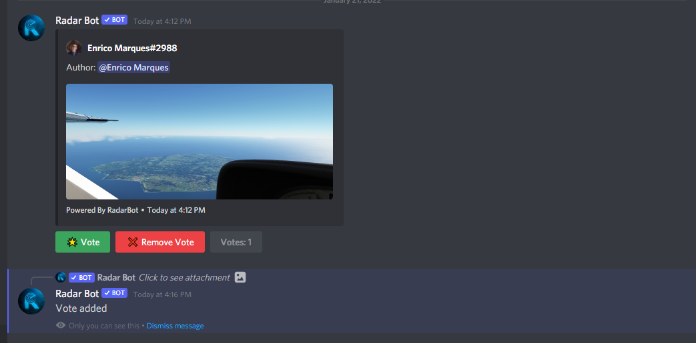
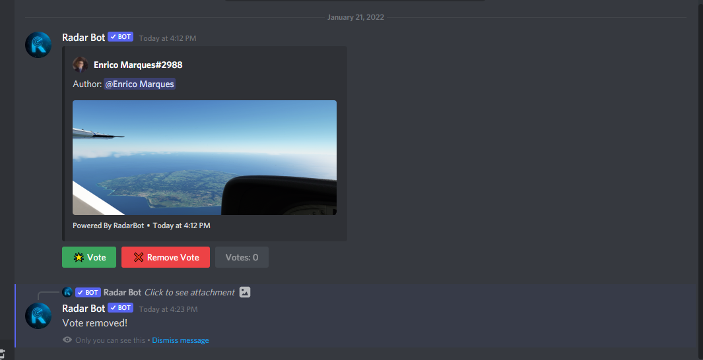
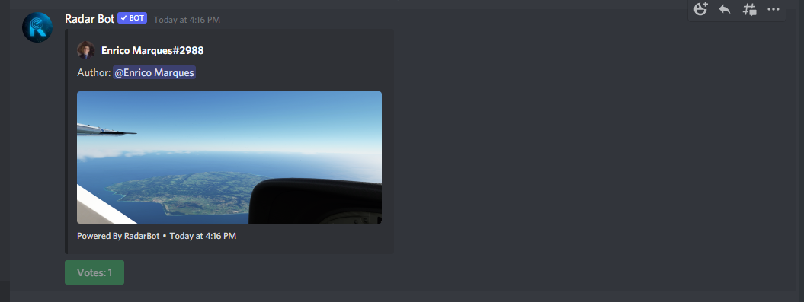
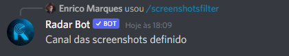

# 📸Configurar o sistema de capturas de tela

### Qual é o sistema de captura de tela?

_O sistema de captura de tela é uma forma de votar na melhor captura de tela do servidor! Onde os membros colocam suas fotos em um canal (você pode escolher o canal), o bot os reconhece e adiciona os 3 itens (Adicionar Voto, Remover Voto e a quantidade de votos) em breve falaremos mais sobre eles. Após o bot adicionar os itens, o voto é liberado quando atinge o mínimo de votos que você escolheu na configuração, essa foto é enviada para outro canal (geralmente chamado Top-Screenshots, mas a escolha é sua) onde estão as melhores screenshots e quem decide são os membros do próprio servidor!_

## Configurando o sistema de captura de tela

**Primeiro passo**

_Crie dois canais, um para os membros postarem suas fotos e outro para as melhores capturas de tela_


!!! warning
      **_AVISO_**
      
      Para o correto funcionamento do sistema de captura de tela, verifique se a permissão do bot para enviar mensagem de incorporação nesses canais está habilitada

      Para isso, vá nas configurações do canal -> permissões -> Adicionar o bot como opção de permissãopersonalizada -> e habilite essas opções ```EMBED_LINK``` e ```MANAGE_MESSAGES```, conforme mostrado nas imagens abaixo

      


      

**Segundo passo**

_Digite o comando de configuração para este tipo `/setupscreenshot`
ele pedirá 3 argumentos:_

- **screenshotschannel:** _Aqui você escolhe o canal onde o membro colocará suas fotos, no meu caso colocarei #capturas de tela_

- **topscreenshotschannel:** _Aqui você escolhe o canal das melhores screenshots, no meu caso vou colocar #top-screenshots_

- **minimumvots:** _Aqui você escolhe a quantidade de votos mínimos que você tem que ter para que a foto vá para o canal dos melhores screenshots, no meu caso para fins de demonstração vou colocar 1 voto mas fique a vontade para colocar como quantos achar necessário._


_O bot responderá:_


**e o sistema estará configurado, vamos testar?**

- _Coloque uma foto no canal definido para fotos_



_Podemos ver que está funcionando e também os 3 elementos que falei anteriormente_

**Se você clicar em votar:**



_Ele registra o voto e manda mensagem privada que deu certo!_

**Se você clicar em votar, mas já tiver um voto desse membro:**


_Não permite adicionar outro voto, apenas um por membro, a mensagem também é privada_

**Se você remover o voto:**



_Ele avisa que removeu o voto em mensagem privada_

**Se você remover o voto quando não tiver voto daquele membro:**


_Ele avisa que não tem votos, também em mensagem privada_

**E após atingir o número mínimo de votos, o bot envia uma foto para o canal configurado para as melhores capturas de tela**



**Para bloquear texto no canal de postagem de votos, use este comando:**


_O bot enviará a confirmação de que funcionou e toda vez que você enviar um texto neste canal ele apagará a mensagem enviada e enviará uma mensagem no privado:_


**Se você quiser desabilitar o sistema de captura de tela use o comando:** `/deactivatescreenshots `


_Enviará o comando e será desabilitado_

!!! aviso
      Somente administradores de servidor (usuários com permissão de `ADMINISTRATOR`) podem definir o Sistema de Captura de Tela

_Se você tiver alguma dúvida, junte-se ao nosso servidor de suporte clicando [aqui](https://discord.com/invite/DEtGv4wUNX)_