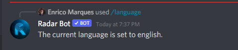
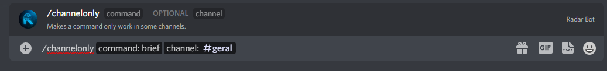

###  /requiredrole 

:::caution

Apenas os administradores do servidor (usuários com permissão `ADMINISTRATOR`) podem modificar as configurações do RadarBot!

:::

*Neste comando você pode bloquear comandos para posições específicas para este tipo o comando abaixo:*

*Na foto abaixo a resposta do Bot:*

:::note

Mudei [comando] para taf para fazer a demonstração

:::

### /language

:::caution

Apenas os administradores do servidor (usuários com permissão `ADMINISTRATOR`) podem modificar as configurações do RadarBot!

:::

*Para saber o idioma que o Radar Bot está usando no servidor use este comando*

:::note
Se você quiser alterar o idioma, use este [comando](../Settings/#setlanguage)
:::
    

### /command 

:::caution

Apenas os administradores do servidor (usuários com permissão `ADMINISTRATOR`) podem modificar as configurações do RadarBot!

:::

*Para desabilitar ou habilitar um comando Radar Bot em seu servidor use este comando*

*** /command <"enable" or "disable"> <"Command Name">***

e o bot responderá:

### /channelonly

:::caution

Somente administradores de servidor (usuários com permissão de ADMINISTRATOR) podem modificar as configurações do RadarBot!

:::

*Para permitir ou não um comando em um canal específico do seu servidor use este comando*

*e o bot responderá:*

