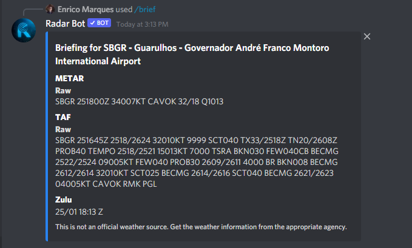
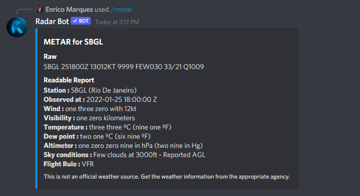
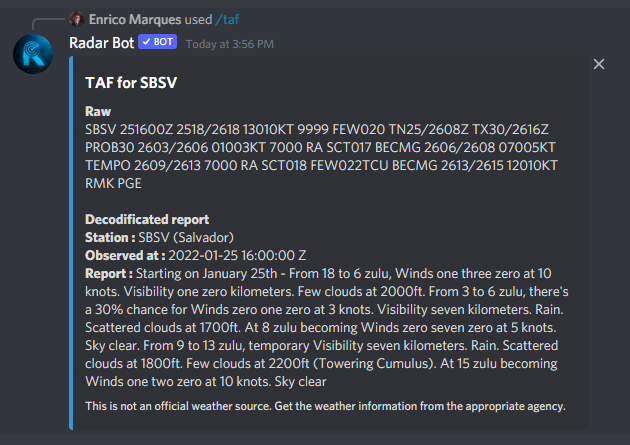
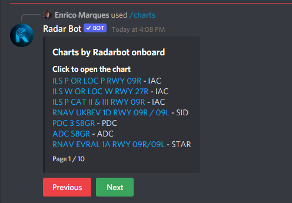

### /brief[ICAO]

*Você está voando ou controlando e quer saber rapidamente o horário do metar, taf e Zulu, basta digitar o comando breve e o ICAO do aeroporto que deseja essa informação e em poucos segundos o bot retornará:*

### /metar[ICAO]

*Quer mais detalhes do metar do aeroporto, ou melhor, já decodificado basta digitar o comando metar, ele responderá com o metar já decodificado para você*

### /taf[ICAO]

*Se o comando metar não foi suficiente, temos o comando taf, ele enviará o taf decodificado para facilitar sua simulação*

### /charts[ICAO]

*Para ter as cartas dos EUA e do Brasil diretamente em discord, use nosso comando de letras, o bot fará uma paginação com as cartas recebidas via API para navegar entre as páginas use os botões abaixo da mensagem*

:::note
Somente quem executou o comando pode mover as páginas, caso algum outro membro interfira, o bot enviará uma mensagem privada
:::
:::note
Após 120 segundos o comando foi executado, os botões são desabilitados
:::