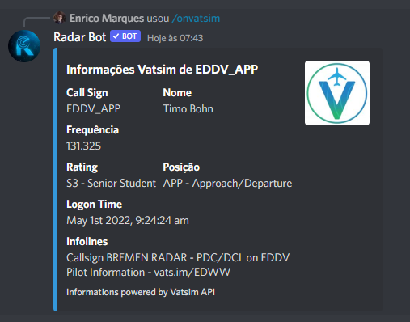

### /vatsim [location]

*Neste comando você coloca uma localização, no meu caso estou colocando um começo de um ICAO, o bot irá buscar as informações da API do Vatsim e mostrará todas as posições ativas com essas iniciais*

**Se você inserir um que ninguém está conectado:**

*O bot retornará uma mensagem de erro informando que ninguém está conectado com esse indicativo*

### /onvatsim [callsign]
*O comando onvatsim mostra informações de pessoas online no Vatsim com detalhes, por enquanto está funcionando apenas para ATCs mas já estamos corrigindo a versão piloto*

**ATC**

**Piloto**

*Em Breve*

**Se você inserir um que ninguém está conectado:**

*O bot retornará uma mensagem de erro informando que ninguém está conectado com esse indicativo*

