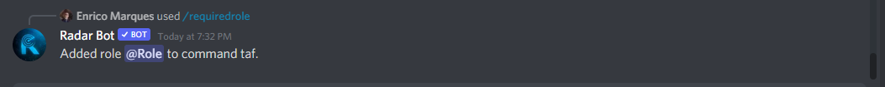
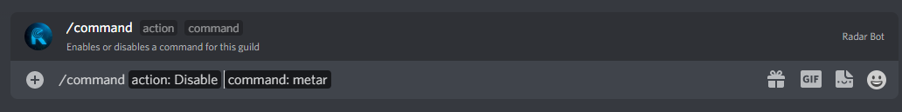
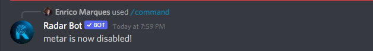
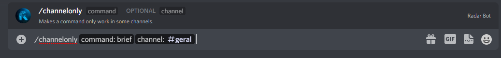

###  /requiredrole 

:::caution

Only server administrators (users with `ADMINISTRATOR` permission) can modify RadarBot settings!

:::

*This command you can block commands for specific positions for this type the command below:*

*In the photo below the Bot's response:*

:::note

I changed [command] to taf to do the demo

:::

### /language

:::caution

Only server administrators (users with `ADMINISTRATOR` permission) can modify RadarBot settings!

:::

*To know the language that Radar Bot is using on the server use this command*

:::note
If you want to change the language use this [command](../Settings/#setlanguage)
:::
    

### /command 

:::caution

Only server administrators (users with `ADMINISTRATOR` permission) can modify RadarBot settings!

:::

*To disable or enable a Radar Bot command on your server use this command*

*** /command <"enable" or "disable"> <"Command Name">***

*and the bot will respond:*

### /channelonly

:::caution

Only server administrators (users with `ADMINISTRATOR` permission) can modify RadarBot settings!

:::

*To allow or not a command in a specific channel of your server use this command*

*and the bot will respond:*

