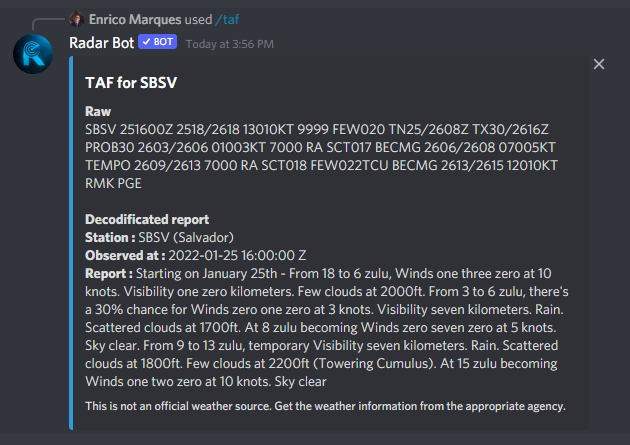

### /brief[ICAO]

*Are you flying or controlling and want to know quickly the metar, taf and Zulu time, just type the brief command and the ICAO of the airport you want this information and in a few seconds the bot will return:*

### /metar[ICAO]

*Want more details of airport metar, or rather already decoded just type metar command, it will reply with metar already decoded for you*

### /taf[ICAO]

*If the metar command was not enough, we have the taf command, it will send the decoded taf to facilitate your simulation*

### /charts[ICAO]

*To have the letters from the USA and Brazil directly in discord, use our command of letters, the bot will make a pagination with the letters received via API to navigate between the pages use the buttons below the message*

:::note
 Only those who executed the command can move the pages, if any other member interferes, the bot will send a private message
:::
:::note
After 120 secconds the command has been executed, the buttons are disabled
:::