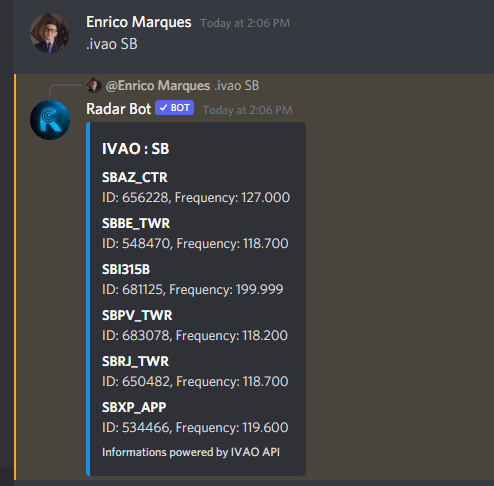
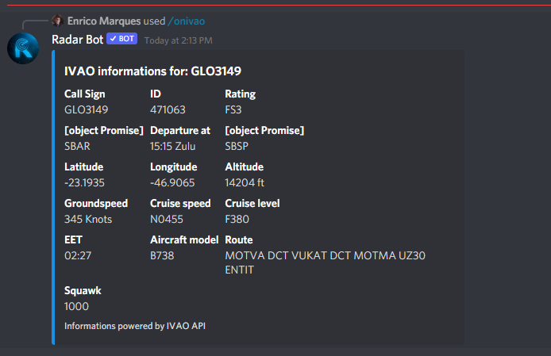

### /ivao[location]

*This command shows information from an ICAO or beginning of one, taking this information from the IVAO API, as you can see in the photo below:*

### /onivao[ICAO]

*The onivao command shows detailed information of a controller or pilot connected to the network, the information used comes from the IVAO API in the photos below we can see the operation of the command for ATC and Pilot*

**Pilot**

**ATC**

