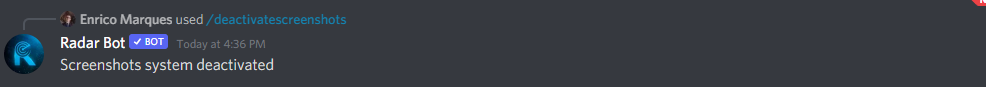

:::caution
Only server administrators (users with`ADMINISTRATOR`permission) can modify RadarBot Screenshots System!
:::

### /setupscreenshots
:::note
This command is available by Slash Commands, make sure the bot is allowed to use this type of command on your server
:::

*Command to set the screenshots system on the server, it will ask for some arguments such as screenshots channel, top screenshots channel and minimum votes if you want to see a guide explained step by step on how to configure this system on your server click [here](../../guides/setup-screenshots/)*

### /screenshotsfilter

*This command allows or not the use of text in the channel chosen by you of screenshots (channel where the members put the screenshots) if you run this command it will not stop sending text and will send a message in private to the member who tries to send the message*

### /deactivatescreenshots

*This command disables the server screenshots system to use just type ``/deactivatescreenshots`` and if you want the system again just type the command to configure the system*

