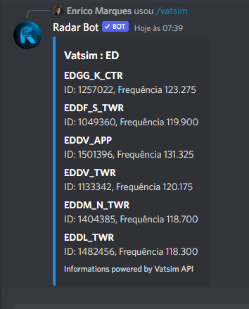

### /vatsim [location]

*In this command you put a location, in my case I am putting an ICAO start, the bot will search the Vatsim API information and will show all active positions with those initials*

**If you enter a that no one is connected:**

*The bot will return an error message that no one is currently connected with that callsign*

### /onvatsim [callsign]
*The onvatsim command shows information of people online at Vatsim with details, for now it is working only for ATCs but we are already correcting the pilot version*

**ATC**

**Pilot**

*Coming Soon*

**If you enter a that no one is connected:**

*The bot will return an error message that no one is currently connected with that callsign*

