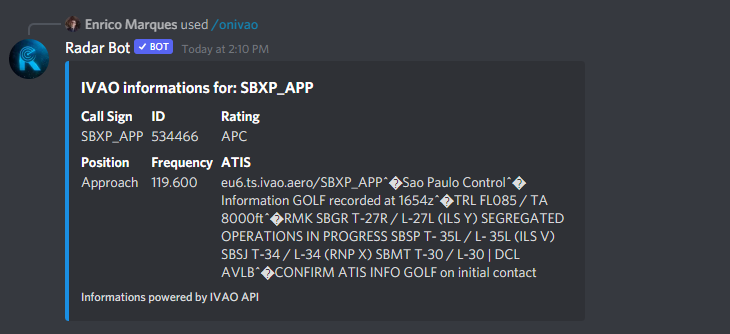

### /ivao[location]

*Este comando mostra informações de uma ICAO ou início de uma, retirando essas informações da API da IVAO, como você pode ver na foto abaixo:*

### /onivao[ICAO]

*O comando onivao mostra informações detalhadas de um controlador ou piloto conectado à rede, as informações utilizadas são provenientes da API IVAO nas fotos abaixo podemos ver o funcionamento do comando para ATC e Piloto*

**Pilot**

**ATC**

