---

title: 📸Setup Screenshots System
---


### O que é o sistema de captura de tela?

*O sistema de captura de tela é uma forma de votar na melhor captura de tela do servidor! Onde os membros colocam suas fotos em um canal (você pode escolher o canal), o bot os reconhece e adiciona os 3 itens (Adicionar Voto, Remover Voto e a quantidade de votos) em breve falaremos mais sobre eles. Após o bot adicionar os itens, o voto é liberado quando atinge o mínimo de votos que você escolheu na configuração, essa foto é enviada para outro canal (geralmente chamado Top-Screenshots, mas a escolha é sua) onde estão as melhores screenshots e quem decide são os membros do próprio servidor!*


## Configurando o sistema de captura de tela
**Primeiro Passo**

*Crie dois canais, um para os membros postarem suas fotos e outro para as melhores capturas de tela*


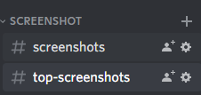

:::caution
     
Para o correto funcionamento do sistema de captura de tela, verifique se a permissão do bot para enviar mensagem de incorporação nesses canais está habilitada

Para isso, vá nas configurações do canal -> permissões -> Adicionar o bot como opção de permissão personalizada -> e habilite essas opções ```EMBED_LINK``` e ```MANAGE_MESSAGES```, conforme mostrado nas imagens abaixo


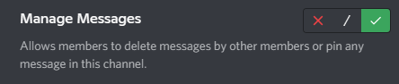

:::
**Segundo Passo**


*Digite o comando de configuração para este tipo ```/setupscreenshot```
ele vai pedir 3 argumentos:*

* **screenshotschannel:** *Aqui você escolhe o canal onde o membro colocará suas fotos, no meu caso colocarei #screenshots*

* **topscreenshotschannel:** *Aqui você escolhe o canal das melhores screenshots, no meu caso vou colocar #top-screenshots*

* **minimumvotes:** *Aqui você escolhe a quantidade de votos mínimos que tem que ter para que a foto vá para o canal das melhores screenshots, no meu caso para fins de demonstração vou colocar 1 voto mas fique a vontade para colocar quantos achar necessário.*


*O bot responderá:*

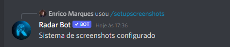

**e o sistema estará configurado, vamos testar?**

* *Coloque uma foto no canal definido para fotos*

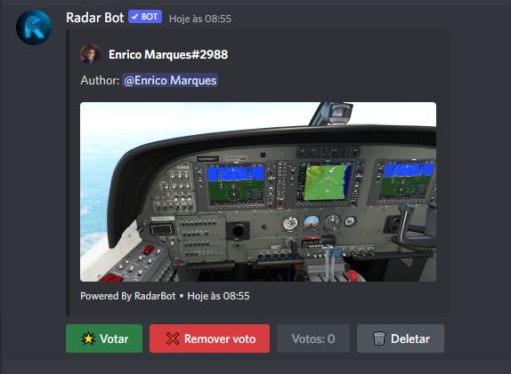

*Podemos ver que está funcionando e também os 3 elementos que falei anteriormente e o botão de deletar*

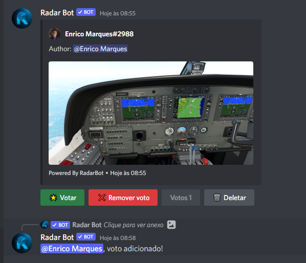

*Ele registra o voto e manda mensagem privada dizendo que deu certo!*

**Se você clicar em votar, mas já tiver um voto desse membro:**

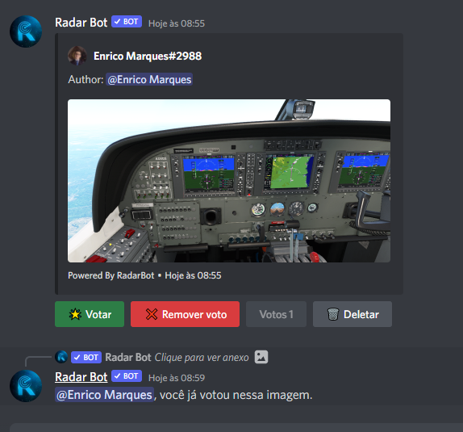

*Não permite adicionar outro voto, apenas um por membro, a mensagem também é privada*

**Se você remover o voto:**

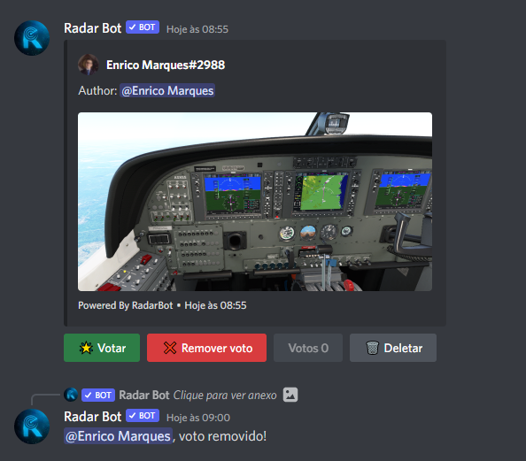

*Ele avisa que removeu o voto em mensagem privada*

**Se você remover o voto quando não tiver voto para aquele membro:**

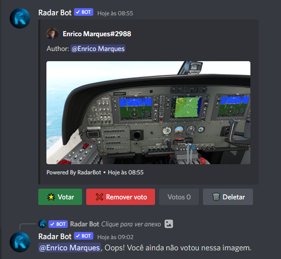

*Ele avisa que não tem votos, também em mensagem privada*

**E após atingir o número mínimo de votos, o bot envia uma foto para o canal configurado para as melhores capturas de tela**

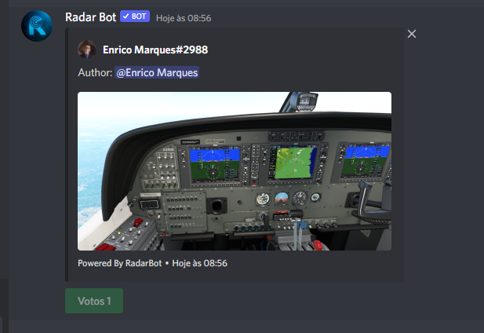

**Caso queira deletar uma imagem que você acabou de mandar, basta clicar no botão deletar e sua imagem será deletada**

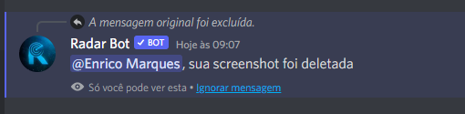

**Mas se a foto não for sua e tentar deletar o bot responderá:**

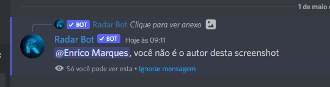

**Para bloquear texto no canal de postagem de votos, use este comando:**


*O bot enviará a confirmação de que funcionou e toda vez que você enviar um texto neste canal ele apagará a mensagem enviada e enviará uma mensagem no privado:*

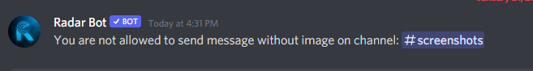

**Se você quiser desabilitar o sistema de captura de tela use o comando:** ```/deactivatescreenshots ```


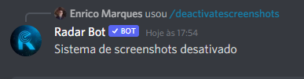

*It will send the command and it will be disabled*


:::caution

Somente administradores de servidor (usuários com permissão de `ADMINISTRATOR`) podem definir o Sistema de Captura de Tela

:::


*Se você tiver alguma dúvida, junte-se ao nosso servidor de suporte clicando [aqui](https://discord.com/invite/DEtGv4wUNX)*


